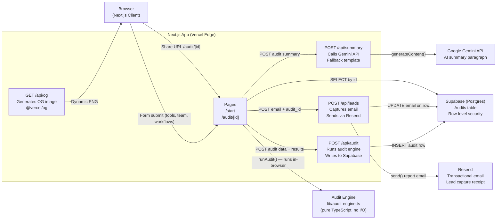

# Architecture — SpendLens

## System Diagram

---

## Data Flow: Form Submit → Shareable URL

1. **User fills 3-step form** (`/start`). State is persisted in `localStorage` via `useAuditForm` hook. If the page reloads mid-audit, nothing is lost.

2. **Audit engine runs client-side** (`lib/audit-engine.ts`). It's pure TypeScript — no network calls, no async. Given `tools[]`, `teamSize`, `orgType`, and `growthTrajectory`, it runs 9 deterministic rules in order and returns `AuditSummary`. The result is computed in <5ms in the browser.

3. **Results are written to Supabase** via `POST /api/audit`. The API route receives the full audit data, inserts a row into the `audits` table, and returns the UUID. This is the ID used in the shareable URL.

4. **AI summary is generated** via `POST /api/summary`. The route sends the `AuditSummary` JSON to Gemini 1.5 Flash with a structured prompt. If the API is unavailable or returns empty, the fallback template constructs a sentence from the actual numbers — the page is never blank.

5. **Shareable URL is constructed**: `/audit/[uuid]`. The results page is server-rendered, fetching from Supabase on the server, so it renders correctly when opened in incognito or shared with someone else.

6. **OG image is generated** via `/api/og?id=[uuid]`. Uses `@vercel/og` to produce a 1200×630 PNG showing the audit title and key savings number. This is what shows up in Twitter/Slack link previews.

7. **Email capture** (`POST /api/leads`). User enters email → server updates the existing audit row with the email field → Resend sends the full report to their inbox.

---

## Stack Justification

### Next.js over plain React
- **API routes co-located**: The audit engine, AI summary, and lead capture all run as Next.js API routes. No separate Express server, no CORS config, same deploy.
- **SSR for the results page**: `/audit/[id]` fetches from Supabase on the server, so the HTML is complete before it reaches the browser. Shared links render correctly in social previews and in incognito (no client-side flash of empty state).
- **Edge-native OG images**: `@vercel/og` runs at the edge, generating dynamic Open Graph images without a headless browser. This only works inside Next.js — plain React would require a separate service.

### Supabase over Firebase
- **Postgres, not documents**: Audit data has a natural relational structure. SQL lets us run `SELECT avg(total_monthly_savings) WHERE org_type = 'saas'` in the dashboard. Firebase would require a custom aggregation pipeline.
- **Row-level security**: Each audit is owned by its session. RLS policies prevent one user from reading another user's audit data server-side, without any application-layer auth code.
- **Better free tier for our workload**: Supabase's free tier includes 500MB database, 2GB bandwidth, and generous API calls. Firebase free tier is more restrictive on Firestore reads at scale.
- **Open-source and portable**: Supabase is Postgres under the hood. If we ever move off the managed platform, we take our data without any proprietary format conversion.

### Resend over SendGrid
- **Developer experience**: Resend's API is one function call with a typed SDK. No template IDs, no campaign management UI, no dashboard for what should be a simple transactional email.
- **Free tier**: 100 emails/day free, no credit card required. SendGrid's free tier requires domain verification and has reputation issues on new domains.
- **Deliverability**: Resend is purpose-built for transactional email. Developers using Resend report consistently better inbox placement than SendGrid on new domains — critical for a lead capture email where inbox delivery is the product.

---

## Scale Analysis: What Breaks at 10,000 Audits/Day

### Current bottlenecks

| Component | Current State | Breaks At |
|---|---|---|
| Supabase (free tier) | Shared Postgres, 500MB | ~50k audit rows |
| Gemini API | Per-request, no caching | 429 rate limits at ~60 RPM |
| Vercel serverless | Cold starts on `/api/audit` | Latency spikes, not failure |
| Resend | 100/day free tier | 100 emails/day |

### Fixes at 10k audits/day

**1. Supabase connection pooling**  
Next.js serverless functions create a new database connection per invocation. At 10k audits/day (~7 RPS peak), this exhausts the 25 connection limit on Supabase's free/pro tier. Fix: enable **PgBouncer** in Supabase (Settings → Database → Connection pooling) and switch the connection string to the pooled URL. This lets 100s of serverless functions share 25 real connections via transaction-mode pooling.

**2. Cache audit results at the CDN edge**  
The results page (`/audit/[id]`) re-fetches from Supabase on every request. An audit result never changes after creation. Fix: add `Cache-Control: s-maxage=31536000, stale-while-revalidate` to the server response. Vercel's edge caches the rendered HTML and serves it from 40+ edge nodes with <10ms TTFB. Supabase load drops to near zero for repeat views of shared audits.

**3. Rate limit at the CDN level**  
The `/api/summary` route calls Gemini which has strict RPM limits. Fix: add rate limiting at Vercel's edge using middleware with an IP-based token bucket (e.g., `@upstash/ratelimit` with Redis). Reject requests over limit with a 429 before they hit the serverless function. The client falls back to the template summary — UX degrades gracefully.

**4. Batch Resend sends**  
At 10k audits × N% email capture rate, we hit Resend's daily limit. Fix: upgrade to Resend's $20/month plan (50k emails/month) or queue emails via a worker (e.g., Inngest) that batches sends and retries on failure.
