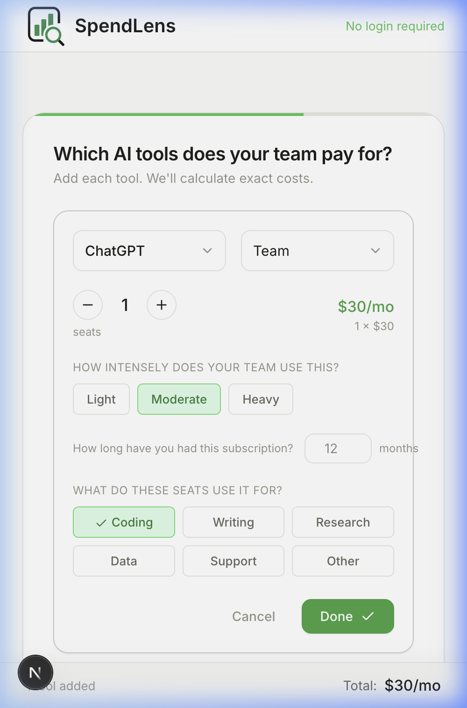
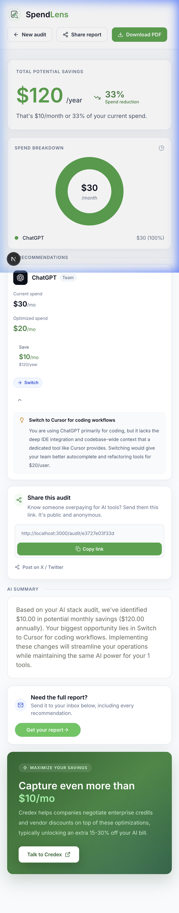

# SpendLens — AI Stack Auditor

SpendLens is a free 2-minute tool that audits your startup's AI tool subscriptions, detects redundant overlap, and surfaces specific downgrade and consolidation actions with exact dollar savings. It's built for engineering managers and CTOs at Series A startups who've noticed AI subscription costs creeping up but haven't had time to run the numbers.

**Live app → https://spend-lens.vercel.app**

---

## Screenshots

### Landing Page


### Audit Form — Tool Configuration


### Results Page — Savings Report


---

## Quick Start

### Prerequisites
- Node.js 20+
- pnpm (or npm)

### 1. Clone and install
```bash
git clone https://github.com/shubhamnagota/SpendLens.git
cd SpendLens
npm install
```

### 2. Set environment variables
```bash
cp .env.example .env
```

Fill in `.env`:
```
NEXT_PUBLIC_SUPABASE_URL=          # From Supabase dashboard → Settings → API
NEXT_PUBLIC_SUPABASE_ANON_KEY=     # Same page, anon public key
SUPABASE_SERVICE_ROLE_KEY=         # Same page, service role key (server-only)
GEMINI_API_KEY=                    # Google AI Studio → Get API Key
RESEND_API_KEY=                    # Resend dashboard → API Keys
RESEND_FROM_EMAIL=                 # Verified sender in Resend (e.g. onboarding@resend.dev for testing)
```

### 3. Set up Supabase
Run this SQL in your Supabase project's SQL Editor:
```sql
create table audits (
  id uuid primary key default gen_random_uuid(),
  created_at timestamptz default now(),
  team_size int,
  org_type text,
  tools jsonb,
  results jsonb,
  total_monthly_savings numeric,
  total_annual_savings numeric,
  email text
);
```

### 4. Run locally
```bash
npm run dev
# Open http://localhost:3000
```

### 5. Deploy to Vercel
```bash
npx vercel --prod
```
Add all `.env` values as Vercel Environment Variables in the dashboard before deploying.

---

## Decisions

### 1. Hardcoded audit rules over LLM-generated recommendations
The audit engine (`lib/audit-engine.ts`) runs 9 deterministic rules against pricing data — not a language model. LLMs hallucinate numbers. When the output is "you'll save $X/month," it has to be exact, auditable, and reproducible. The one place AI is used (the summary paragraph on the results page) has an explicit fallback that constructs a real sentence using actual numbers from the audit, so the page is never empty even if the API call fails.

### 2. Per-tool workflow tagging instead of a single org type
Early versions let you pick "startup" or "enterprise" as a global filter. This produced generic output. The redesign lets users tag each tool with what their team actually uses it for (coding, writing, research, etc.). This surfaces real overlap — e.g., "you're paying for Cursor AND GitHub Copilot both exclusively for coding" — instead of guessing at org-level patterns.

### 3. Supabase over Firebase for the persistence layer
Supabase gives us Postgres, which means we can write SQL for the audit analytics dashboard later, add row-level security for multi-tenant support, and export data to BI tools. Firebase's document model would have required schema redesign to do the same. Row-level security was set up from day one so audit data is owned by the session, not globally readable.

### 4. Shareable URL without authentication
Every audit gets a UUID stored in Supabase and a public URL (`/audit/[id]`). No login required to view a shared link. This is the deliberate choice: the tool's value proposition is "share your audit with your CFO or co-founder." Adding auth friction before they see the value kills the share loop. Trade-off: audits are semi-public by URL (no login wall). Acceptable for the use case — nobody is sharing their team's AI bill with strangers.

### 5. Resend over SendGrid for the lead capture email
Resend's developer experience is dramatically better: clean API, React Email templates, proper deliverability defaults out of the box, and a free tier that covers 100 emails/day. SendGrid's free tier is more generous on volume but requires DNS setup, email template management in a separate UI, and has historically bad deliverability on cold domains. For a new product where every email matters, Resend wins.

---

## Tech Stack

| Layer | Choice | Why |
|---|---|---|
| Framework | Next.js 16 | SSR for OG images, API routes co-located, no separate backend |
| Database | Supabase (Postgres) | SQL, row-level security, free tier generous |
| AI summary | Gemini 1.5 Flash | Fast, cheap, works; fallback template if API fails |
| Email | Resend | Best DX, great deliverability, free tier |
| Styling | Tailwind CSS v4 | Utility-first, fast iteration |
| Animations | Framer Motion | Smooth transitions without custom CSS |
| Testing | Vitest | Native ESM, fast, zero config |
| Deployment | Vercel | Next.js native, zero config |
